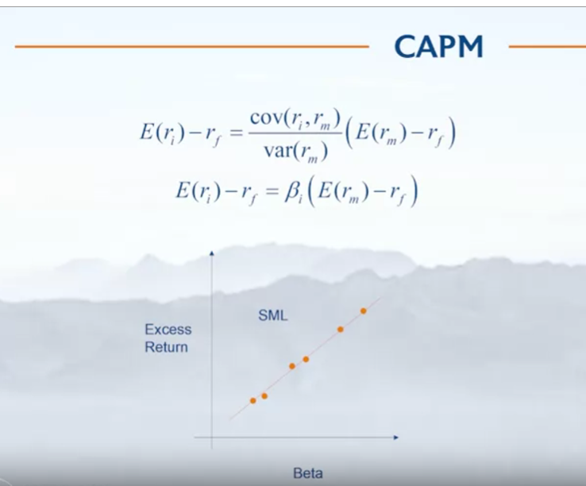

## Advanced portfolio construction using python

### Intro to factor investing

#### What is factor
A factor is a variable which influences the returns of the assets. it represents commonality of the returns something outside  
of individual assets.  
Exposure to factor risk over the long run yields rewards which is called risk premium.  
#### type of factors
1. Macro factors: Growth, inflation. It is hard to make a portfolio based on these factors.
2. Statistical factors: Something extracted from the data which may or may not be identifiable.
3. Intrinsic factors or style factors: Value-Growth, momentum, low volatility.

#### Factor model
in factor model, we decompose returns in to sum of factor premia (or factor returns multiplied by coefficients). in other words:  
r1 = b11 * f1 + b12 * f2 + ......+b1k * fk alpha + epsilon  
r2 = b21 * f1 + b22 * f2 + ......+b2k * fk alpha + epsilon  
where b11, b12 etc are some coeficients. there are also called as factor loading.  

#### CAPM
As per capm, excess return of any security is beta of the security multiplied by the excess return of the market itself.  
As you can see, capm is a special case of factor model. In capm, there is just one factor which is market.  

if you plot every security excess return with its beta, you will find a straight line. slope of the st line will be the excess market return.  

